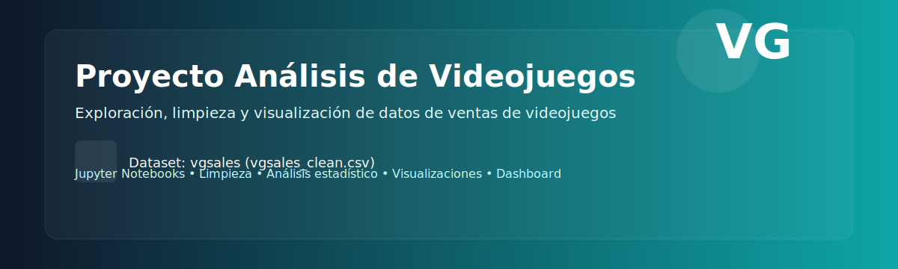

  

# Proyecto: Análisis de Videojuegos 🎮

**Exploración, limpieza y visualización de datos de ventas de videojuegos**

---

## 📌 Resumen

Este repositorio contiene un proyecto de análisis de datos sobre ventas de videojuegos usando datasets `data/vgsales.csv` y `data/vgsales_clean.csv`. El objetivo es realizar limpieza, análisis estadístico, visualizaciones avanzadas y desplegar un pequeño dashboard interactivo.

## 🔍 Estructura principal del proyecto

- `data/` — Datasets originales y limpios (`vgsales.csv`, `vgsales_clean.csv`).
- `notebooks/` — Notebooks paso a paso: carga, EDA, limpieza, análisis y visualizaciones.
- `panel/` — Aplicación de panel/dashboard (`app_pr.py`) y componentes UI en `panel/ui/`.
- `utils/` — Utilidades para configuración y carga de datos (`config.py`, `data_loader.py`).

## ▶️ Uso rápido

1. Instala dependencias (ej. `pip install -r requirements.txt` si existe).
2. Explora los notebooks en `notebooks/` con Jupyter.
3. Ejecuta el dashboard: `python panel/app_pr.py`.

> 💡 Nota: Asegúrate de tener instalado `panel` y `pandas` para el dashboard y los notebooks.

## 🧾 Datos

- Fuente principal: `data/vgsales.csv` (original).
- Versión preparada y lista para análisis: `data/vgsales_clean.csv`.

## 🧑‍💻 Autor y contacto

- Proyecto: *01-proyecto-videojuegos* — mantenido por el autor del repositorio.

---

