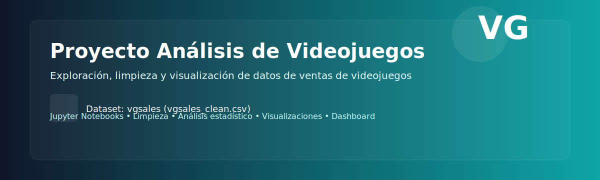

  

# Project: Video Game Analysis 🎮

**Exploration, cleaning, and visualization of video game sales data**

---

## 📌 Summary

This repository contains a data analysis project on video game sales using the datasets `data/vgsales.csv` and `data/vgsales_clean.csv`. The goal is to perform cleaning, statistical analysis, advanced visualizations, and deploy a small interactive dashboard.

## 🔍 Main Project Structure

- `data/` — Original and cleaned datasets (`vgsales.csv`, `vgsales_clean.csv`).
- `notebooks/` — Step-by-step notebooks: loading, EDA, cleaning, analysis, and visualizations.
- `panel/` — Panel/dashboard application (`app_pr.py`) and UI components in `panel/ui/`.
- `utils/` — Utilities for configuration and data loading (`config.py`, `data_loader.py`).

## ▶️ Quick Start

1. Install dependencies (e.g., `pip install -r requirements.txt` if available).  
2. Explore the notebooks in `notebooks/` using Jupyter.  
3. Run the dashboard: `python panel/app_pr.py`.

> 💡 Note: Make sure to have `panel` and `pandas` installed for the dashboard and notebooks.

## 🧾 Data

- Main source: `data/vgsales.csv` (original).  
- Prepared and analysis-ready version: `data/vgsales_clean.csv`.

## 🧑‍💻 Author & Contact

- Project: *01-proyecto-videojuegos* — maintained by the repository author.

